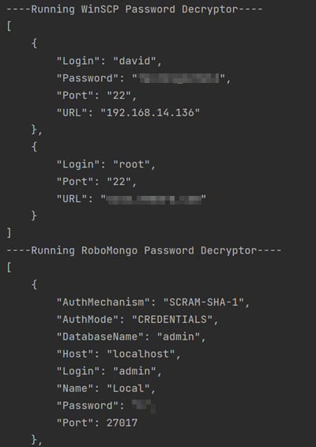

# XMCredentialsDecryptor

## Overview

Common tools such as RoboMongo or MobaXTerm, store your credentials encrypted on your workstation. Use the following tool to decrypt all of them.

You can read the full explanation on how they are decrypted [here](https://medium.com/xm-cyber/decrypting-vmware-workstation-passwords-for-fun-f34284c5b9cd).

## Prerequisites
Run this command:
```
cd main
pip3 install -r requirement.txt
```

## Get started
To decrypt the credentials, run:
```commandline
python3 main.py
```
You'll see similar to the following:


